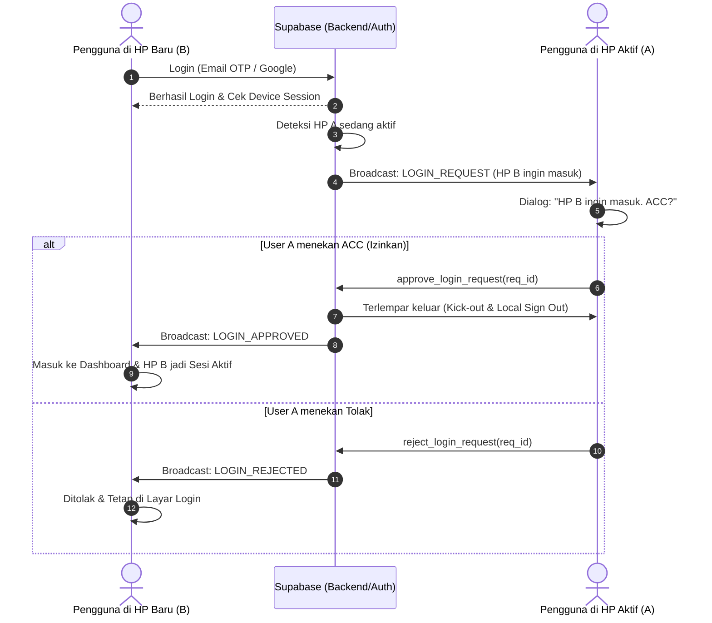

# Spesifikasi Teknis & Arsitektur Aplikasi
## **Toomi: Multi-Friend 3D Companion Overlay (Android Edition)**

Aplikasi mobile Android interaktif yang menghadirkan karakter 3D melayang (*floating overlay*) di atas layar homescreen dan aplikasi lain. Aplikasi ini menghubungkan pengguna dengan teman-temannya secara *real-time* langsung melalui layar HP menggunakan sistem **ID Toomi**.

---

## 1. Ringkasan Fitur Utama & Logika Baru

* **Autentikasi Wajib Google & Email OTP:** Pengguna dapat masuk menggunakan akun Google atau verifikasi kode OTP 6-digit yang dikirimkan ke Email.
* **ID Toomi Unik & Multi-Friend Pairing:** Setiap akun mendapatkan ID Toomi unik (misal: `TM-9A2K7X`). Pairing dilakukan dengan menambahkan ID Toomi teman. 1 akun dapat berteman dan terhubung dengan banyak orang (1-to-many / multi-friend).
* **Kebijakan 1 User = 1 HP Aktif:** Setiap user hanya dapat aktif pada 1 perangkat pada satu waktu. Jika sudah keluar (*logout*), user dapat masuk di perangkat lain tanpa hambatan.
* **Mekanisme Login Approval & Sesi Terlempar (Kick-out):**
  * Ketika ada perangkat baru (HP B) mencoba masuk ke akun yang sedang aktif di HP A:
  * HP A menerima notifikasi/alert *real-time*: *"Perangkat [HP B] ingin masuk ke akun Toomi Anda. Izinkan (ACC)?"*
  * Jika di-ACC oleh HP A:
    * HP A otomatis terlempar keluar (*logged out* & service berhenti).
    * HP B disetujui (*approved*) dan menjadi sesi aktif utama.
  * Jika ditolak oleh HP A: Permintaan masuk HP B dibatalkan.
* **Floating 3D Companion Overlay:** Karakter 3D animasi melayang transparan di atas layar homescreen maupun aplikasi Android lainnya.
* **Real-time Cross-Screen Interactions:** Aksi ke teman terpilih (*poke*, *wave*, bubble chat, status baterai) diproses secara *real-time* via Supabase Realtime WebSocket (< 100ms).

---

## 2. Arsitektur Teknis Sistem Android

```
┌─────────────────────────────────────────────────────────┐
│                    Aplikasi Utama Android               │
│       (Auth OTP/Google, Multi-Friend List, Toomi ID)    │
└────────────────────────────┬────────────────────────────┘
                             │
                             ▼
┌─────────────────────────────────────────────────────────┐
│               Android Foreground Service                │
│       (Device Session Control & Realtime Companion Sync)│
└──────────────┬───────────────────────────┬──────────────┘
               │                           │
               ▼                           ▼
┌──────────────────────────────┐ ┌────────────────────────┐
│  Window Manager (Overlay)    │ │   Supabase Realtime    │
│ (SYSTEM_ALERT_WINDOW)        │ │  (WebSockets Broadcast)│
└──────────────┬───────────────┘ └───────────┬────────────┘
               │                            │
               ▼                            ▼
┌──────────────────────────────┐ ┌────────────────────────┐
│ Google Filament 3D Engine    │ │ Event Sync Antar Teman │
│ (Low-Poly GLB Models)        │ │ (Animasi & Bubble Chat)│
└──────────────────────────────┘ └────────────────────────┘
```

---

## 3. Skema Data & Kontrol Sesi (Supabase)

### Tabel Utama:
1. `profiles`: Menyimpan `toomi_id` (unik), `email`, `display_name`, `active_device_id`, `active_device_name`, `battery_level`, dsb.
2. `friendships`: Relasi pertemanan banyak-ke-banyak (`user_id`, `friend_id`, `status: PENDING | ACCEPTED`).
3. `login_requests`: Antrean perizinan pergantian sesi perangkat (`requester_device_id`, `requester_device_name`, `status: PENDING | APPROVED | REJECTED`).

---

## 4. Alur Interaksi & State Device Control

